# Cấu hình IPsec Site-to-Site Route-Based VPN trên OPNsense

Tài liệu này hướng dẫn cấu hình **IPsec Site-to-Site VPN dạng Route-Based sử dụng VTI (Virtual Tunnel Interface)** trên OPNsense, kết nối tới một peer VPN chạy trên **VMware Cloud Director / NSX Edge Gateway**.

> [!IMPORTANT]
> Các địa chỉ IP và tên object trong tài liệu là thông số của môi trường lab. Khi áp dụng production, hãy thay bằng thông số thực tế của hệ thống.
>
> Không đưa **Pre-Shared Key (PSK)** thật lên GitHub. Ảnh PSK trong repository này đã được che giá trị.

---

## 1. Mô hình kết nối

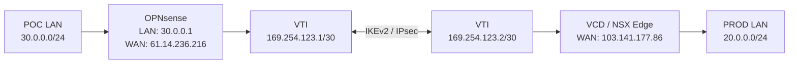

### IP plan sử dụng trong lab

| Thành phần | Site POC - OPNsense | Site PROD - VCD Edge |
|---|---|---|
| WAN/Public IP | `61.14.236.216` | `103.141.177.86` |
| LAN | `30.0.0.0/24` | `20.0.0.0/24` |
| VTI IP | `169.254.123.1` | `169.254.123.2` |
| VTI subnet | `169.254.123.0/30` | `169.254.123.0/30` |
| Remote LAN cần route | `20.0.0.0/24` | `30.0.0.0/24` |

### Crypto profile phía peer

| Tham số | Giá trị |
|---|---|
| IKE Version | IKEv2 |
| IKE Encryption | AES-256 |
| IKE Integrity/Digest | SHA-256 |
| Diffie-Hellman | Group 14 / MODP 2048 |
| IKE SA Lifetime | 86400 giây |
| ESP Encryption | AES-256 |
| ESP Integrity/Digest | SHA-256 |
| PFS | Group 14 |
| Child SA Lifetime | 3600 giây |
| Authentication | Pre-Shared Key |

> [!NOTE]
> `DPD delay` và `SA lifetime/rekey time` là hai tham số khác nhau. Không dùng trường DPD để thay thế cho IKE/Child SA lifetime. Nếu giao diện OPNsense của bạn expose các trường lifetime/rekey riêng, hãy cấu hình khớp với peer hoặc giữ default nếu hai bên đã negotiate ổn định.

---

## 2. Prerequisites

Trước khi cấu hình, cần đảm bảo:

- OPNsense WAN có Internet/reachability tới peer public IP `103.141.177.86`.
- Peer VCD Edge có reachability tới OPNsense WAN `61.14.236.216`.
- UDP `500` và `4500` được phép giữa hai public IP.
- Nếu không dùng NAT-T, ESP (IP protocol 50) cũng phải được phép trên đường truyền.
- Hai LAN không overlap với nhau hoặc với subnet/VIP/route khác trong hệ thống.
- Pre-Shared Key giống nhau ở hai đầu.
- Route-Based VPN phía peer đã có VTI `169.254.123.2/30`.

---

# 3. Cấu hình trên OPNsense

## Bước 1 - Tạo Virtual Tunnel Interface (VTI)

Vào:

```text
VPN → IPsec → Virtual Tunnel Interfaces
```

Tạo VTI với thông số:

| Field | Value |
|---|---|
| Enabled | Enable |
| Reqid | `10` |
| Local address | `61.14.236.216` |
| Remote address | `103.141.177.86` |
| Tunnel local address | `169.254.123.1` |
| Tunnel remote address | `169.254.123.2` |
| Skip firewall rules | Disable |
| Name | `VTI-PROD` |

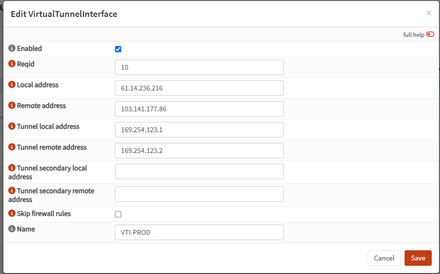

**Điểm quan trọng:** `Reqid` phải trùng với `Reqid` của Child SA ở bước Phase 2.

---

## Bước 2 - Tạo Pre-Shared Key

Vào:

```text
VPN → IPsec → Pre-Shared Keys
```

Cấu hình:

| Field | Value |
|---|---|
| Local Identifier | `61.14.236.216` |
| Remote Identifier | `103.141.177.86` |
| Pre-Shared Key | `<YOUR-PSK>` |
| Type | `PSK` |

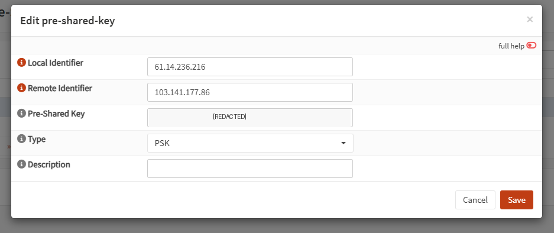

> [!WARNING]
> Không commit PSK thật vào Git repository. Nếu repository đã từng chứa PSK, hãy **rotate PSK**, không chỉ xóa khỏi commit mới.

---

## Bước 3 - Tạo IKE Connection / Phase 1

Vào:

```text
VPN → IPsec → Connections
```

Tạo connection, ví dụ `PROD-EDGE-P1`:

| Field | Value |
|---|---|
| Enabled | Enable |
| Proposal | `aes256-sha256-modp2048 [DH14]` |
| Version | `IKEv2` |
| MOBIKE | Disable |
| Local addresses | `61.14.236.216` |
| Remote addresses | `103.141.177.86` |
| Description | `PROD-EDGE-P1` |

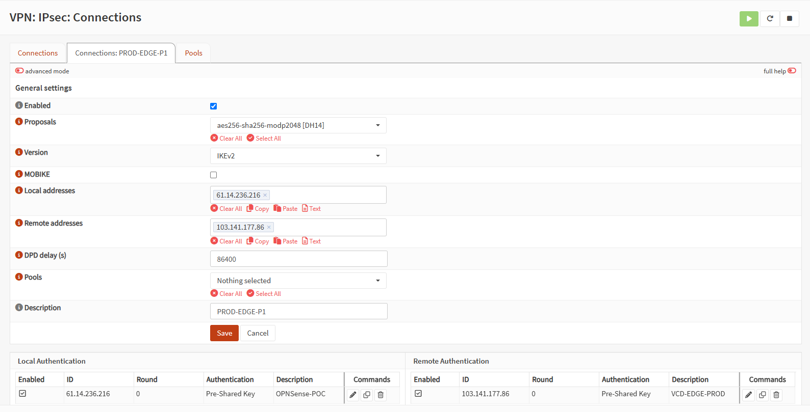

### Giải thích proposal

```text
aes256-sha256-modp2048
```

Tương ứng:

```text
AES-256
SHA-256
DH Group 14 / MODP 2048
```

Đây phải khớp với Security Profile của peer.

---

## Bước 4 - Cấu hình Local Authentication

Trong Connection vừa tạo, thêm **Local Authentication**:

| Field | Value |
|---|---|
| Enabled | Enable |
| Connection | `PROD-EDGE-P1` |
| Round | `0` |
| Authentication | `Pre-Shared Key` |
| ID | `61.14.236.216` |
| Description | `OPNSense-POC` |

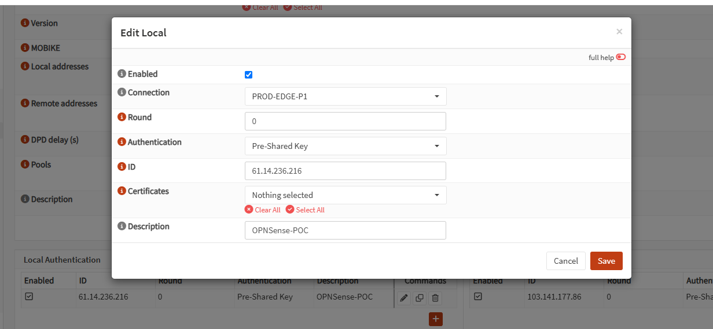

---

## Bước 5 - Cấu hình Remote Authentication

Thêm **Remote Authentication**:

| Field | Value |
|---|---|
| Enabled | Enable |
| Connection | `PROD-EDGE-P1` |
| Round | `0` |
| Authentication | `Pre-Shared Key` |
| ID | `103.141.177.86` |
| Description | `VCD-EDGE-PROD` |

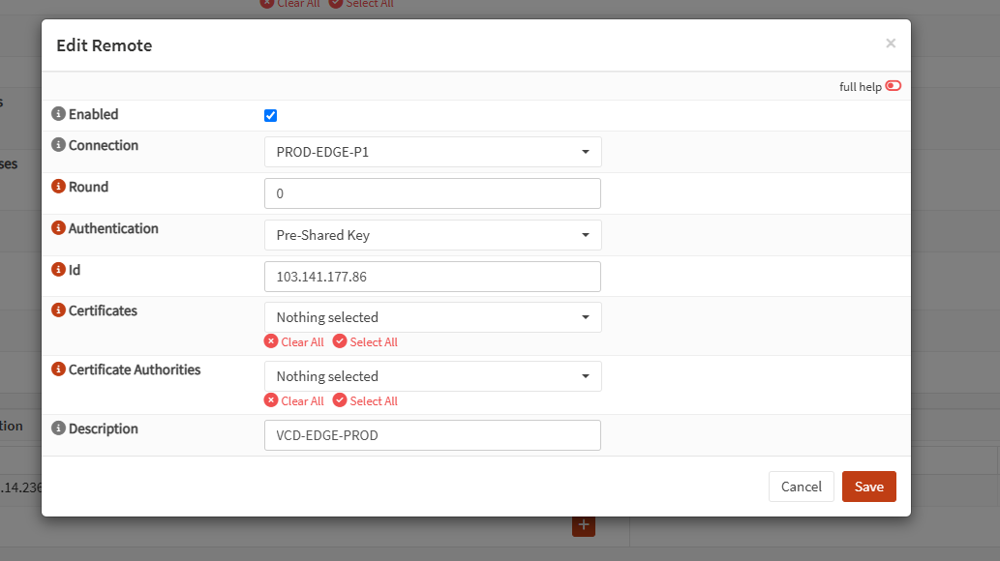

---

## Bước 6 - Tạo Child SA / Phase 2

Trong Connection `PROD-EDGE-P1`, thêm Child SA:

| Field | Value |
|---|---|
| Enabled | Enable |
| Mode | `Tunnel` |
| Policies | **Disable / unchecked** |
| Start Action | `Trap` |
| DPD Action | `Clear` |
| Reqid | `10` |
| ESP proposals | `aes256-sha256-modp2048 [DH14]` |
| Local | `0.0.0.0/0` |
| Remote | `0.0.0.0/0` |
| Description | `PROD-EDGE-P2` |

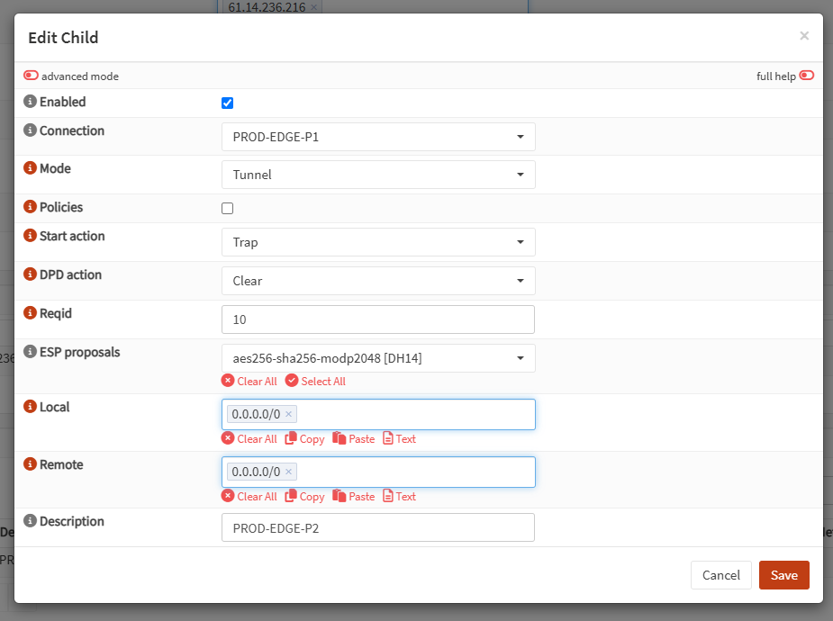

### Vì sao Local/Remote là `0.0.0.0/0`?

Với **Route-Based IPsec**, việc quyết định subnet nào đi qua tunnel được xử lý bởi **routing table**, không phải policy selector kiểu Policy-Based VPN.

Do đó:

```text
Child SA: 0.0.0.0/0 ↔ 0.0.0.0/0
Routing : 20.0.0.0/24 → VTI peer 169.254.123.2
```

**Policies phải bỏ tick** để traffic được forward theo VTI/routing thay vì cài policy selector vào kernel.

---

## Bước 7 - Assign VTI thành interface

Vào:

```text
Interfaces → Assignments
```

Sau khi VTI được tạo đúng, OPNsense sẽ sinh interface dạng `ipsec<Reqid>`.

Với `Reqid = 10`:

```text
ipsec10
```

Assign interface này và đặt Description là `VTIPROD`.

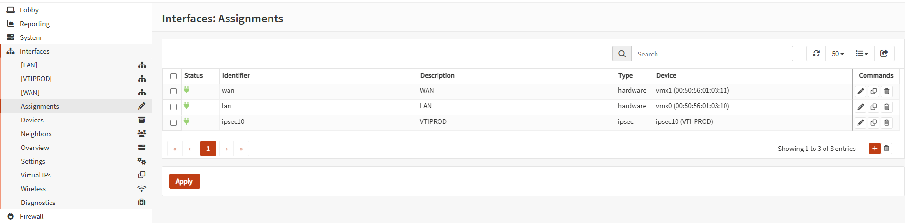

Mapping trong lab:

```text
ipsec10 → VTIPROD → VTI-PROD
```

---

## Bước 8 - Tạo Gateway cho VTI

Vào:

```text
System → Gateways → Configuration
```

Tạo gateway:

| Field | Value |
|---|---|
| Name | `PROD_VTI_G` |
| Interface | `VTIPROD` |
| Address Family | `IPv4` |
| IP Address | `169.254.123.2` |
| Upstream Gateway | Disable |

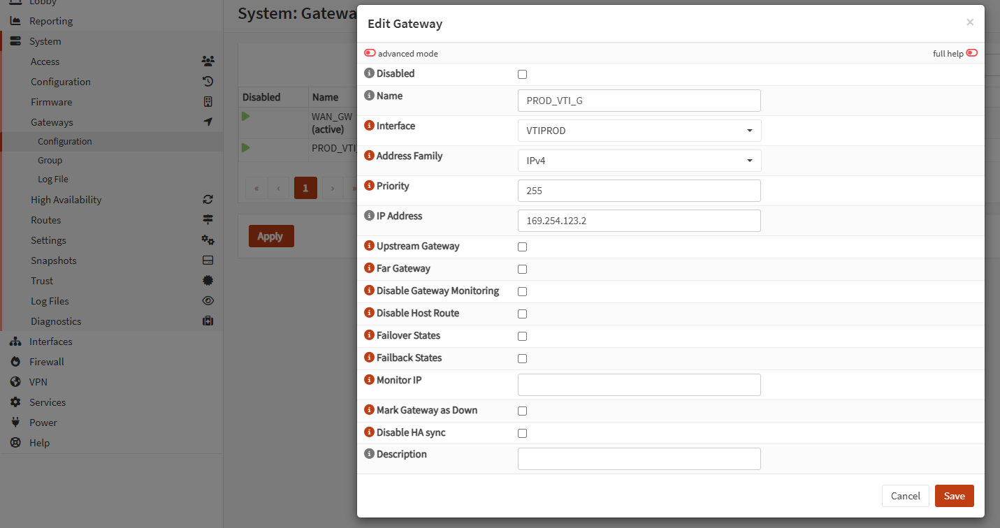

Gateway này chính là **VTI IP phía peer**.

---

## Bước 9 - Tạo Static Route tới remote LAN

Vào:

```text
System → Routes → Configuration
```

Tạo route:

```text
Network : 20.0.0.0/24
Gateway : PROD_VTI_G - 169.254.123.2
```

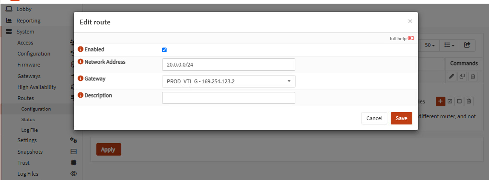

Sau khi Apply, kiểm tra routing table từ OPNsense shell:

```sh
netstat -rn4
```

Kết quả cần có route tương tự:

```text
20.0.0.0/24    169.254.123.2    UGS    ipsec10
169.254.123.2   link#...         UH     ipsec10
```

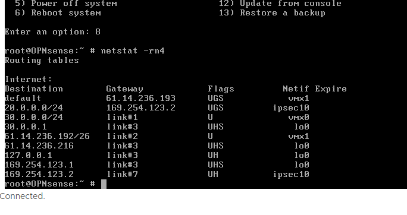

---

## Bước 10 - Tạo Firewall Rules

### 10.1 LAN → PROD

Nếu LAN đang có default rule:

```text
LAN net → any : Pass
```

thì traffic `30.0.0.0/24 → 20.0.0.0/24` đã được phép.

Trong production nên thu hẹp rule theo đúng source/destination/service cần thiết.

### 10.2 PROD → POC qua IPsec

Trên OPNsense phiên bản mới, traffic VTI mặc định được filter tại interface group:

```text
IPsec encapsulation
```

Tạo rule:

```text
Action      : Pass
Direction   : In
IP Version  : IPv4
Protocol    : any
Source      : 20.0.0.0/24
Destination : 30.0.0.0/24
Gateway     : None
```

Nếu cần traffic hai chiều rõ ràng, có thể tạo thêm rule ngược lại theo policy vận hành.

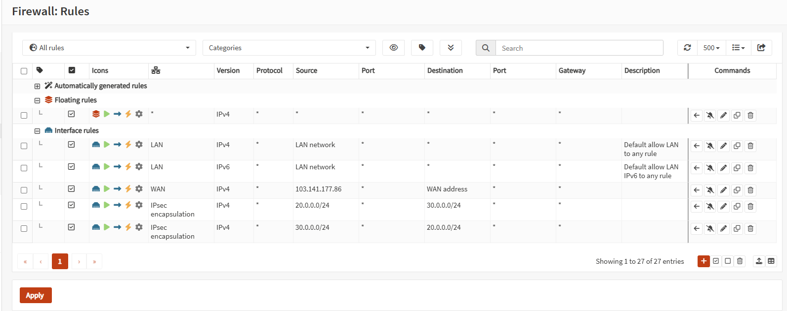

> [!IMPORTANT]
> Không chỉ tạo rule trên interface `VTIPROD`. Với default IPsec filtering behavior của OPNsense, hãy kiểm tra rule tại **IPsec encapsulation**.

---


# 4. Kiểm tra trạng thái VPN

Vào:

```text
VPN → IPsec → Status Overview
```

Cần thấy:

```text
Phase 1 / IKE SA   : Established / Up
Phase 2 / Child SA : INSTALLED
```

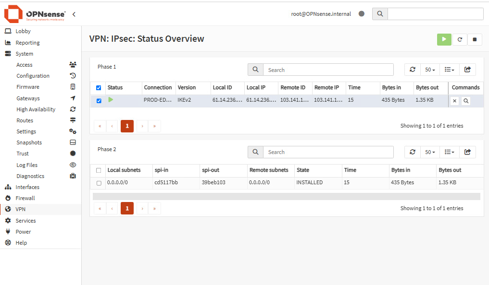

Tunnel **UP** chỉ xác nhận control-plane IPsec đã thiết lập. LAN-to-LAN còn phụ thuộc:

- Static route
- Firewall rule
- NAT exemption
- Return route
- Endpoint firewall
- Không có route/subnet overlap

---

# 5. Connectivity Test

Trong lab này, dùng test VM POC `30.0.0.200` và VM PROD `20.0.0.251`.

Từ POC:

```cmd
ping 20.0.0.251
```

Từ PROD:

```cmd
ping 30.0.0.200
```

Có thể kiểm tra VTI trước:

```text
169.254.123.1 → 169.254.123.2
```

Nếu ping host Windows, kiểm tra Windows Firewall/ICMP rule trước khi kết luận VPN lỗi.

---

